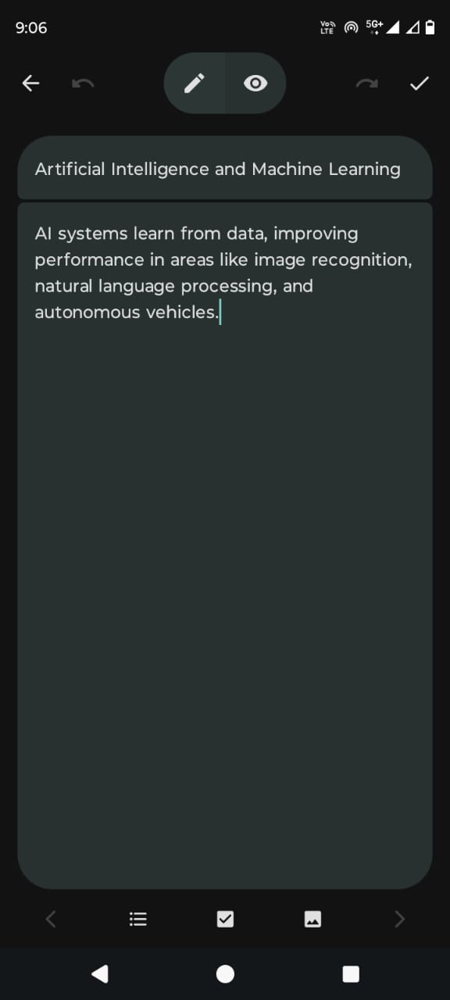

<div align="center">

    
<br></br>

# Swift Notes
Effortless note-taking with a sleek, secure design.

[](https://github.com/tuhin733/SwiftNotes/releases/latest)

---
</div>

[](https://github.com/tuhin733/SwiftNotes/blob/main/LICENSE) 
[](https://github.com/tuhin733/SwiftNotes/issues) 
[](https://github.com/tuhin733/SwiftNotes/stargazers)

# Swift Notes

**Swift Notes** is a simple, feature-rich, and privacy-focused note-taking app for Android built using Jetpack Compose and the Material 3 design system. The app allows users to easily create, manage, and secure notes, with support for multiple languages.

---

## ✨ Features

- **Create, Edit, and Delete Notes**: Simple and intuitive note management.
- **Pin Important Notes**: Keep important notes at the top for quick access.
- **Markdown Support**: Style your notes with markdown using `MarkdownText.kt`.
- **Note Encryption**: Option to encrypt notes for enhanced privacy.
- **Multi-language Support**: Available in:
    - Bengali
    - Gujarati
    - Kannada
    - Malayalam
    - Marathi
    - Punjabi
    - Tamil
    - Telugu
    - Urdu
    - Odia
    - Assamese
    - English
    - Hindi
- **Splash Screen**: Smooth launch experience using Android 12's Splash Screen API.

---

## 📸 Screenshots

<div align="left">
<div align="center">
    
    
    
</div>
</div>

---

## 🛠️ Technologies Used

- **Kotlin**: For Android development.
- **Jetpack Compose**: For building declarative UI.
- **Room Database**: Local storage of notes.
- **Material 3**: For a modern and intuitive UI.

---

## 📖 Getting Started

To get a local copy up and running follow these simple steps.

1. **Clone the repository**:
    ```bash
    git clone https://github.com/tuhin733/SwiftNotes.git
    ```
2. **Open in Android Studio**:
    - Launch Android Studio and open the cloned project.
3. **Build and Run**:
    - Run the app on an emulator or a physical device.

---


## 📝 License

Distributed under the GPL-3.0 License. See `LICENSE` for more information.

---

## 📫 Contact

Naim - [tuhinsarkar746@gmail.com](mailto:your-email@example.com)  
GitHub: [tuhin733](https://github.com/tuhin733)

---

## 💡 Acknowledgments

- Jetpack Compose Documentation
- Material Design Guidelines
- Open Source Community

---
